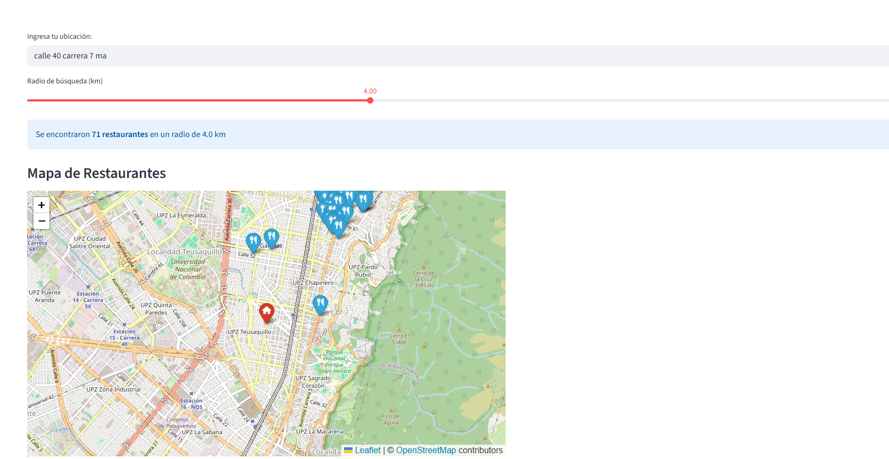
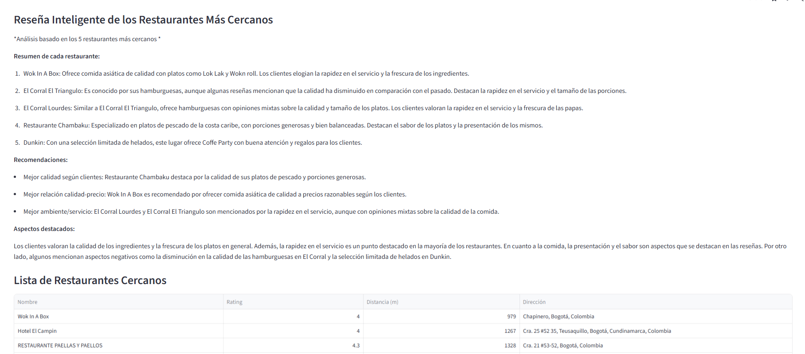
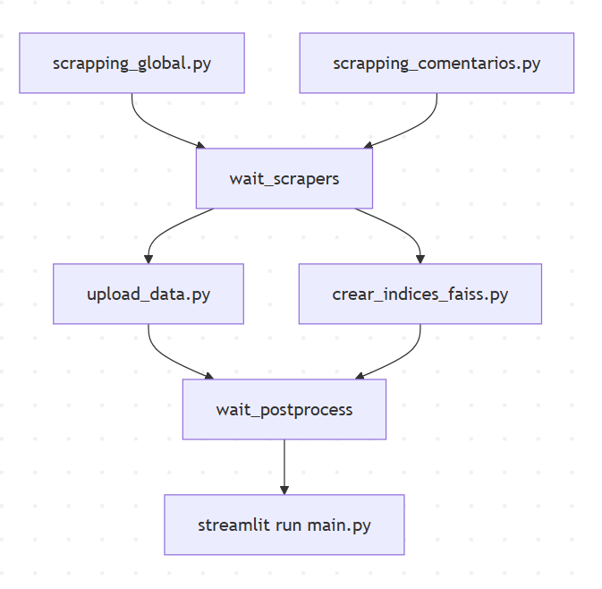

# Buscador Inteligente de Restaurantes – Scraping, ETL, FAISS y Streamlit

Este proyecto implementa un sistema completo de búsqueda inteligente de restaurantes, combinando:

- **Scraping paralelo** para obtención de datos
- **ETL automatizado** con MongoDB
- **Consultas geoespaciales** con índices 2dsphere
- **Búsqueda semántica** con FAISS
- **Análisis inteligente** mediante OpenAI
- **Visualización geográfica** con Streamlit y Folium

El objetivo es ofrecer una plataforma capaz de analizar restaurantes cercanos a una ubicación, mostrar un mapa dinámico y generar un resumen inteligente basado en reseñas reales.

---

## Características Principales

- **Scraping en paralelo**: Obtención simultánea de restaurantes y reseñas
- **Pipeline ETL completo**: Limpieza, integración y carga hacia MongoDB
- **Geospatial Queries**:
  - Uso de índices 2dsphere para `$nearSphere`
  - Búsqueda precisa en un radio definido por el usuario
- **FAISS Vector Indexing**:
  - Codificación de reseñas mediante embeddings
  - Búsqueda semántica rápida para encontrar comentarios relevantes
- **Análisis Inteligente con IA**:
  - Resumen de los 5 restaurantes más cercanos
  - Insights generados con OpenAI exclusivamente basados en datos reales
- **Streamlit Frontend**:
  - Mapa interactivo con Folium
  - Visualización de restaurantes con marcadores
  - Botón para lanzar análisis inteligente
- **Ejecución Orquestada**:
  - Script Bash que coordina scraping, ETL, FAISS y frontend

---

## Estructura del Proyecto

```
.
├── scrapping_global.py
├── scrapping_comentarios.py
├── upload_data.py
├── crear_indices_faiss.py
├── main.py
├── faiss_db/
├── requirements.txt
├── reseñas_restaurantes_api_final.json
├── restaurantes_bogota_multi_zona_final.json
└── run_pipeline.sh
```

---

## Descripción de Componentes

### Scraping

**`scrapping_global.py`**
- Extrae datos generales de restaurantes en Bogotá
- Construye el dataset multi-zona principal
- Obtiene información como nombre, ubicación, rating y dirección

**`scrapping_comentarios.py`**
- Extrae reseñas reales desde API
- Crea el dataset para embeddings y FAISS
- Captura comentarios de usuarios para análisis semántico

Ambos scripts se ejecutan **en paralelo** para reducir el tiempo total del pipeline.

### ETL y FAISS

**`upload_data.py`**
- Realiza limpieza y transformación de datos
- Carga datos procesados a MongoDB
- Genera índices geoespaciales (2dsphere) para búsquedas eficientes por ubicación

**`crear_indices_faiss.py`**
- Preprocesamiento del texto de las reseñas
- Codificación de reseñas mediante modelos de embeddings
- Creación del índice FAISS persistente para búsqueda semántica

**`indices.py`**
- Gestión y creación de índices en MongoDB
- Configuración de índices geoespaciales

Estos procesos también corren **en paralelo** después del scraping.

### Aplicación Interactiva

**`main.py`**
- Interfaz principal construida con Streamlit
- Búsqueda geoespacial combinada con búsqueda semántica
- Visualización de resultados en mapa interactivo con Folium
- Integración con OpenAI para generar análisis contextual
- Tabla de restaurantes cercanos con información detallada

### Orquestación

**`run_pipeline.sh`**
1. Ejecuta el scraping paralelo (`scrapping_global.py` y `scrapping_comentarios.py`)
2. Cuando termina, ejecuta ETL + FAISS en paralelo (`upload_data.py` y `crear_indices_faiss.py`)
3. Finalmente ejecuta: `streamlit run main.py`

---

## Imágenes del Proyecto y Explicación

### 1. Mapa Interactivo y Búsqueda Geoespacial




**Descripción**: Interfaz principal de Streamlit mostrando:
- **Campo de búsqueda**: El usuario ingresa su ubicación (ej: "calle 40 carrera 7 ma")
- **Selector de radio**: Slider para definir el radio de búsqueda en kilómetros (configurado en 4.0 km)
- **Contador de resultados**: Indica cuántos restaurantes se encontraron (71 restaurantes en este caso)
- **Mapa interactivo Folium**: 
  - Marcador rojo indica la ubicación del usuario
  - Marcadores azules muestran los restaurantes cercanos
  - Visualización geográfica clara del área de búsqueda

La búsqueda utiliza índices geoespaciales de MongoDB (`$nearSphere`) para ordenar automáticamente por distancia.

### 2. Análisis Inteligente de Restaurantes Cercanos

**Descripción**: Muestra el resultado del análisis generado por OpenAI sobre los 5 restaurantes más cercanos a la ubicación del usuario. El sistema presenta:
- **Resumen de cada restaurante**: Incluye tipo de comida, características destacadas y opiniones de clientes
- **Recomendaciones personalizadas**: Basadas en calidad, relación calidad-precio y ambiente
- **Aspectos destacados**: Calidad de ingredientes, frescura, rapidez en el servicio y presentación de platos

Ejemplo de insights generados:
- Wok In A Box: Comida asiática de calidad con platos como Lok Lak y Wokn roll
- El Corral El Triangulo: Reconocido por hamburguesas, con opiniones sobre variación en calidad
- Restaurante Chambaku: Especializado en pescado caribeño con porciones generosas





### 3. Pipeline DAG - Flujo de Ejecución



**Descripción**: Diagrama de flujo que ilustra la arquitectura del pipeline automatizado:

**Fase 1 - Scraping Paralelo**:
- `scrapping_global.py` y `scrapping_comentarios.py` se ejecutan simultáneamente
- Se sincronizan en el nodo `wait_scrapers`

**Fase 2 - Procesamiento Paralelo**:
- `upload_data.py`: Carga datos a MongoDB y crea índices geoespaciales
- `crear_indices_faiss.py`: Genera índices de búsqueda semántica
- Se sincronizan en el nodo `wait_postprocess`

**Fase 3 - Despliegue**:
- `streamlit run main.py`: Lanza la aplicación web interactiva

Este diseño en DAG (Directed Acyclic Graph) asegura que cada etapa finalice correctamente antes de iniciar la siguiente, mientras maximiza la paralelización donde es posible.


Link de la aplicacion: https://tabdproyectofinal-n42ermakpmsz8jzncnf29h.streamlit.app/

---

## Servicios y Funcionalidades Clave

### MongoDB Geoespacial
- Índices `2dsphere` para coordenadas geográficas
- Queries con `$nearSphere` para búsquedas por proximidad
- Orden automático por distancia
- Soporte para radio de búsqueda configurable

### FAISS (Facebook AI Similarity Search)
- Índice vectorial para textos de reseñas
- Búsqueda semántica rápida y eficiente
- Permite encontrar reseñas similares conceptualmente
- Persistencia de índices para reutilización

### OpenAI
- Generación de análisis natural en lenguaje español
- Insights basados exclusivamente en reseñas reales obtenidas
- Resúmenes contextuales de múltiples restaurantes
- Recomendaciones personalizadas según criterios del usuario

### Streamlit + Folium
- Mapa interactivo con marcadores personalizables
- UX intuitiva para usuarios finales
- Visualización dinámica de datos geoespaciales
- Integración fluida entre búsqueda, visualización y análisis

---

## Instalación y Ejecución

### Requisitos Previos
- Python 3.8+
- MongoDB instalado y en ejecución
- API Keys de OpenAI configuradas

### Instalación

```bash
# Clonar el repositorio
git clone [https://github.com/usuario/buscador-restaurantes.git](https://github.com/DAVID316CORDOVA/TABD_PROYECTO_FINAL.git)
cd buscador-restaurantes

# Instalar dependencias
pip install -r requirements.txt

```

### Ejecución del Pipeline Completo

```bash
# Ejecutar el pipeline automatizado
bash run_pipeline.sh
```

Este comando ejecutará todo el proceso end-to-end:
1. Scraping de datos de restaurantes y reseñas
2. Procesamiento ETL y carga a MongoDB
3. Creación de índices FAISS
4. Lanzamiento de la aplicación Streamlit

### Ejecución Manual por Componentes

```bash
# Solo scraping
python scrapping_global.py &
python scrapping_comentarios.py &
wait

# Solo ETL y FAISS
python upload_data.py &
python crear_indices_faiss.py &
wait

# Solo aplicación Streamlit
streamlit run main.py
```

---

## Tecnologías Utilizadas

- **Python 3.8+**: Lenguaje principal del proyecto
- **Streamlit**: Framework para aplicaciones web interactivas
- **MongoDB**: Base de datos NoSQL con capacidades geoespaciales
- **FAISS**: Librería de Facebook para búsqueda de similitud vectorial
- **OpenAI GPT**: Modelo de lenguaje para análisis inteligente
- **Folium**: Visualización de mapas interactivos
- **Pandas**: Manipulación y análisis de datos
- **Requests**: Scraping de datos desde APIs

---

## Configuración Avanzada

### MongoDB
```python
# Configuración de índice geoespacial
db.restaurantes.create_index([("location", "2dsphere")])
```

### FAISS
```python
# Parámetros de búsqueda semántica
dimension = 768  # Dimensión de embeddings
n_results = 5    # Número de resultados similares
```

### OpenAI
```python
# Modelo utilizado
model = "gpt-4"
temperature = 0.7
max_tokens = 1500
```

---

## Contribuciones

Las contribuciones son bienvenidas. Por favor:

1. Fork el proyecto
2. Crea una rama para tu feature (`git checkout -b feature/AmazingFeature`)
3. Commit tus cambios (`git commit -m 'Add some AmazingFeature'`)
4. Push a la rama (`git push origin feature/AmazingFeature`)
5. Abre un Pull Request

---


--

## Contacto


Proyecto Link: [[https://github.com/usuario/buscador-restaurantes](https://github.com/usuario/buscador-restaurantes](https://github.com/DAVID316CORDOVA/TABD_PROYECTO_FINAL.git))

--

